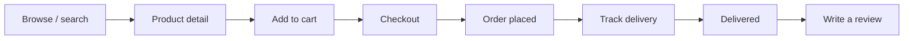
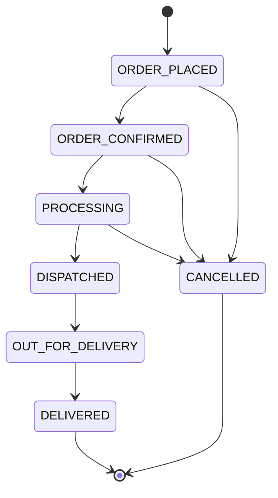

# 00 — Overview

> **Read this first.** It explains what the system is and the vocabulary the rest of the
> documentation uses. Everything after this assumes you know these terms.

---

## What this application is

ShopSphere is an online store. It has two audiences and therefore two faces:

- A **storefront** where anyone can browse, and where a signed-in customer can buy things,
  track deliveries and review what they received.
- An **admin dashboard** where staff manage the catalogue, fulfil orders and watch the numbers.

Both are the same React application talking to the same Spring Boot API. What you can see and do is
decided entirely by the role attached to your account.

---

## The two roles

| Role | Who | What they can do |
|---|---|---|
| `ROLE_CUSTOMER` | Everyone who registers | Their own cart, orders, addresses, profile and reviews — and nothing belonging to anyone else |
| `ROLE_ADMIN` | Seeded on first run | Everything under `/api/admin/**`: products, categories, all orders, all users, the notification log |

There is one account table. An admin is simply a user who also holds `ROLE_ADMIN`. Registration
always creates a customer — the role is assigned server-side and is not something a sign-up request
can influence. See [05 — Security](05-security.md).

---

## The six departments

The store is organised into six categories, seeded on first run:

| Category | URL slug |
|---|---|
| Books | `books` |
| Grocery | `grocery` |
| Kitchen Utensils | `kitchen-utensils` |
| Clothes | `clothes` |
| Electronics | `electronics` |
| Furniture | `furniture` |

An admin can add more. The six are seeded because the application was specified around them, but
nothing in the code hard-codes them beyond that initial seed — categories are ordinary database rows.

---

## The customer journey

At every step from **Order placed** to **Delivered** — and on cancellation — the customer receives a
WhatsApp message. See [09 — WhatsApp Notifications](09-whatsapp-notifications.md).

---

## The order lifecycle

An order moves through a fixed sequence. It cannot skip stages or move backwards.

**Why cancellation stops at dispatch:** once a parcel has physically left the warehouse, putting its
items back into the stock count would be a lie. Cancelling before dispatch restores stock
automatically; after dispatch the order has to go through a returns process, which this system does
not model.

The rules live in one place — `OrderStatus.canTransitionTo(...)` in
`backend/src/main/java/com/ecommerce/entity/OrderStatus.java` — and are enforced on every status
change.

---

## Glossary

Terms used consistently throughout the code and docs.

| Term | Meaning |
|---|---|
| **Principal** | The signed-in user, as Spring Security sees them. Carries the user id, which every service uses to scope queries. |
| **JWT** | The signed token proving who you are. Sent as `Authorization: Bearer <token>` on every request. |
| **Snapshot** | A copy of data frozen at a point in time. Orders snapshot the product name, price and delivery address so later edits cannot rewrite history. |
| **Soft delete** | Marking a product `active = false` instead of removing the row, so orders that reference it stay intact. |
| **Slug** | The URL-safe form of a name: "Kitchen Utensils" → `kitchen-utensils`. |
| **Status history** | The append-only log of every status an order has held, and when. This is what makes real tracking possible. |
| **Specification** | A JPA Criteria predicate builder. One `ProductSpecification` serves browsing, search, filtering and sorting. |
| **Skipped notification** | A message that was composed and recorded but not sent, because Twilio is not configured. The flow still works. |

---

## What is deliberately not here

Being explicit about the boundaries, so you do not go looking for code that does not exist:

- **No payment gateway.** Checkout creates the order directly. A real integration would sit between
  "review order" and "place order" in `OrderService.placeOrder`.
- **No shipping cost or tax calculation.** Order total equals the sum of the line items.
- **No email.** WhatsApp is the only notification channel, though the
  `WhatsAppService` interface is the seam where another would be added.
- **No password reset flow.** A signed-in user can change their password; a forgotten one needs
  admin intervention.
- **No image uploads.** Products store an image *URL*. An admin pastes a link.

---

**Next:** [01 — Getting Started](01-getting-started.md) to get it running.
