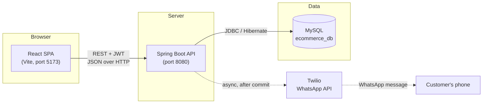
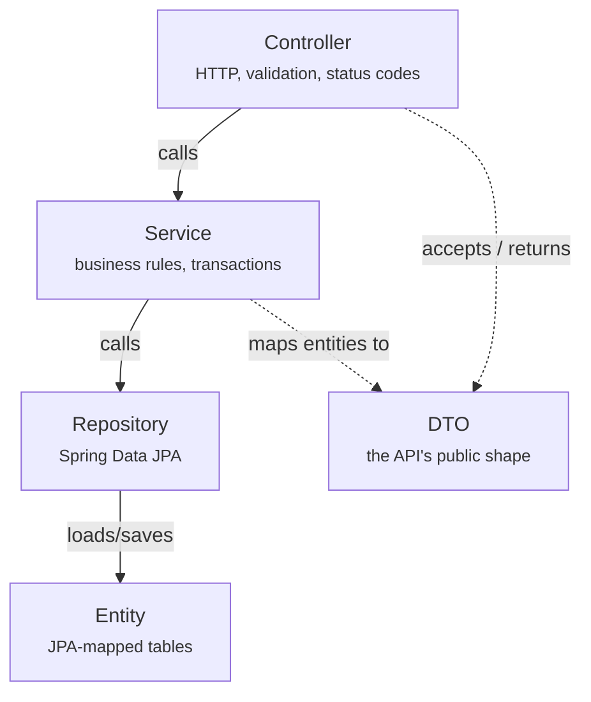
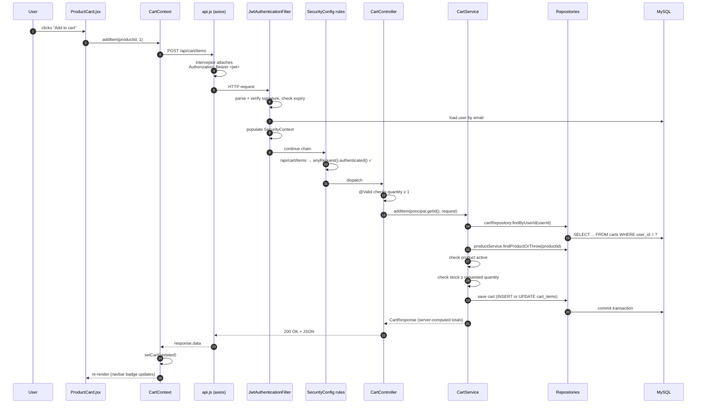

# 02 — Architecture

How the pieces fit together, and one real request traced from a click to a database row and back.

---

## The big picture

Two independently deployable applications talking over HTTP:



**Why separated?** The React app is static files; the API is stateless. Either can be scaled,
redeployed or replaced without touching the other — you could put a mobile app on the same API
tomorrow. The cost is that authentication has to be stateless too, which is why we use JWT rather
than server sessions.

In development, Vite proxies `/api` → `localhost:8080` (see `frontend/vite.config.js`), so the
browser sees a single origin and CORS never fires. CORS is still configured on the backend for
deployments where the two are served from different hosts.

---

## Backend layers

The backend follows a strict four-layer flow. Each layer may only call the one beneath it.



| Layer | Package | Responsibility | Never does |
|---|---|---|---|
| **Controller** | `controller` | Map HTTP to a service call. Validate the request shape. Choose the status code. | Business rules, database access |
| **Service** | `service` | Business rules, transaction boundaries, authorisation scoping | Know about HTTP |
| **Repository** | `repository` | Query the database | Contain business logic |
| **Entity** | `entity` | Map to a table; hold invariants intrinsic to the data | Leave the service layer |
| **DTO** | `dto` | The stable, public JSON contract | Contain logic beyond mapping |

### Why entities never leave the service layer

Every controller accepts and returns a DTO, never a JPA entity. Three concrete reasons:

1. **Nothing can leak.** `UserResponse` has no password field at all — it is structurally
   impossible to serialise a hash, rather than depending on remembering an annotation.
2. **No mass assignment.** `RegisterRequest` has no `roles` field, so a request body cannot grant
   itself `ROLE_ADMIN`. `ProductRequest` has no `averageRating`, so an admin cannot fabricate a
   five-star product.
3. **No lazy-loading surprises.** Serialising an entity outside its transaction triggers
   `LazyInitializationException` or a cascade of hidden queries. DTOs are built inside the
   transaction, deliberately.

`spring.jpa.open-in-view: false` in `application.yml` enforces this — the persistence context is
closed before the response is rendered, so a forgotten fetch fails loudly in development instead of
silently issuing N+1 queries in production.

---

## One request, traced end to end

Let us follow **"add a product to the cart"** all the way through. This single example touches
authentication, authorisation, validation, business rules, persistence and error handling.

### The trace



### What happens at each stage, and why

**1–3 · The click.** `ProductCard.jsx` calls `addItem` from `CartContext`. The component itself has
no idea an HTTP request exists — it asks the cart context to change, and re-renders when it does.

**4 · The token is attached.** The request interceptor in `frontend/src/services/api.js` adds
`Authorization: Bearer <token>` to every outgoing call. No individual service has to remember,
which means no endpoint can accidentally be called unauthenticated.

**5–7 · Authentication.** `JwtAuthenticationFilter` verifies the signature and expiry, then
**re-loads the user from the database**. That re-load matters: it means a disabled or deleted
account stops working immediately, even though its token is still cryptographically valid.

Note what this filter does *not* do: it never rejects a request. A missing or bad token just leaves
the context unauthenticated. That is what lets anonymous product browsing and protected checkout
coexist in one chain.

**8–9 · Authorisation.** `SecurityConfig` decides. `/api/cart/items` matches no public rule, so
`anyRequest().authenticated()` applies. Had this been `/api/admin/**`, `hasRole("ADMIN")` would
apply instead, and a customer token would produce a JSON 403 from `RestAccessDeniedHandler`.

**10 · Request validation.** `@Valid @RequestBody AddToCartRequest` runs Bean Validation. A
quantity of `0` fails `@Min(1)` here and never reaches the service — the response is a 400 carrying
a per-field error map that the form can render inline.

**11 · Into the service, with identity.** The controller passes `principal.getId()`, taken from the
verified token. It does **not** pass any user id from the request body. This is the mechanism that
prevents one customer touching another's cart: there is no id in the request to tamper with.

**12–16 · Business rules, in a transaction.** `CartService.addItem` resolves the cart from the user
id, checks the product is still active, checks stock, then either increments an existing line or
creates one. All inside `@Transactional`, so a failure at any point leaves nothing half-written.

**17–18 · The response.** The service builds a `CartResponse` with subtotals computed server-side in
`BigDecimal`. The client never sends or computes prices.

**19–21 · Back in React.** `CartContext` replaces its state with the server's response — it does not
patch its local copy. The server is the single source of truth for what is in the cart, so the
navbar badge, cart page and checkout can never disagree.

### If something goes wrong

Say the product only has one unit left. `CartService` throws `InsufficientStockException`.
It propagates out of the service, and `GlobalExceptionHandler` catches it:

```json
{
  "timestamp": "2026-08-17T09:14:22Z",
  "status": 409,
  "error": "Conflict",
  "message": "Insufficient stock for 'Cast Iron Skillet': requested 3, only 1 available.",
  "path": "/api/cart/items"
}
```

The axios response interceptor unwraps that into a plain `Error` whose `.message` is exactly that
sentence, and the component shows it in a toast. **One error shape, one handler, one rendering path**
— which is why no controller in this codebase contains a `try/catch`.

---

## Where the important decisions live

If you are looking for the logic behind a rule, it is in one of these:

| Rule | File |
|---|---|
| Which order status transitions are legal | `entity/OrderStatus.java` |
| Who can reach which endpoint | `config/SecurityConfig.java` |
| How checkout validates stock and computes totals | `service/OrderService.java` |
| How product filtering and sorting is built | `repository/ProductSpecification.java` |
| Who may write a review | `service/ReviewService.java` + `OrderRepository.hasUserPurchasedProduct` |
| Which WhatsApp sender is active | `config/NotificationConfig.java` |
| How every error becomes JSON | `exception/GlobalExceptionHandler.java` |

---

## Frontend structure, briefly

Covered fully in [07 — Frontend](07-frontend.md), but the shape is:

```
main.jsx          BrowserRouter → AuthProvider → CartProvider → ToastProvider → App
App.jsx           the route table, and the guards on each route
context/          global state: who is signed in, what is in the cart, toasts
services/         one axios instance + a thin wrapper per API area
hooks/            useAuth, useCart, useToast, useDebounce, useQueryParams
components/       reusable UI with no page-specific knowledge
pages/            one component per route; pages/admin/ for the dashboard
```

The provider nesting order is deliberate: `CartProvider` reads authentication state to decide
whether to load a cart, so it must sit inside `AuthProvider`.

---

**Next:** [03 — Database](03-database.md) for the data model, or [04 — Backend](04-backend.md) for
a package-by-package tour of the code.
