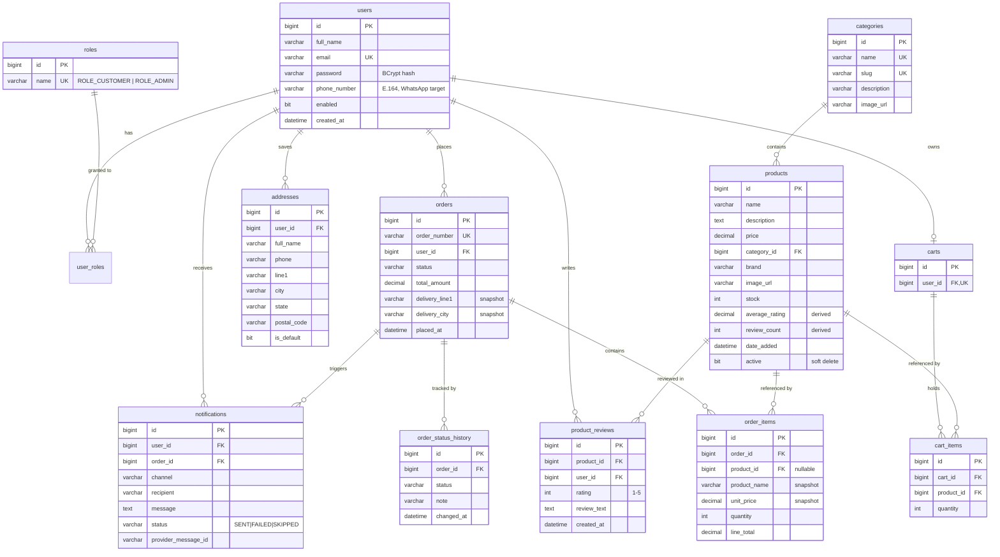

# 03 — Database

The data model, table by table, with the reasoning behind the choices that are not obvious.

The live schema is created by Hibernate at startup. `database/schema.sql` is the same schema written
by hand as commented DDL — useful as a reference and for provisioning manually.

---

## Entity relationship diagram

---

## Three decisions worth understanding

Before the table reference, these three shape the whole model.

### 1. Orders snapshot their data

`order_items` copies `product_name` and `unit_price`. `orders` copies the entire delivery address
into `delivery_*` columns.

This looks like a normalisation error. It is not — it is the point.

> An order records **what was agreed at a moment in time**. If an admin raises a product's price
> next week, or a customer edits the address they used, the order must still show what the customer
> actually paid and where it actually went. A live foreign key to `products.price` would silently
> rewrite financial history every time someone edited the catalogue.

`order_items.product_id` is kept, but is **nullable** and `ON DELETE SET NULL` — it exists for
"buy it again" links and review eligibility, not for reading the price. `orders.address_id` is a
plain column with no FK constraint at all: a soft breadcrumb that is allowed to dangle.

### 2. Status history is a separate table

`orders.status` answers *"where is my order now"*. It cannot answer *"when was it dispatched"*.

`order_status_history` is append-only: every status change writes a row with a timestamp and an
optional note. That is what makes the tracking timeline real rather than a static graphic, and it
doubles as an audit trail of which admin action moved an order when.

### 3. Product ratings are denormalised on purpose

`products.average_rating` and `products.review_count` could both be computed from `product_reviews`.
They are stored because **every product listing sorts and filters by rating**. Running
`AVG(rating) GROUP BY product_id` across the reviews table for every row of every listing page would
be wasteful.

`ReviewService.recalculateProductRating` rewrites both values from scratch after any review is
created, updated or deleted, so they cannot drift.

---

## Table reference

### `roles`

| Column | Type | Notes |
|---|---|---|
| `id` | BIGINT PK | |
| `name` | VARCHAR(30) **UK** | `ROLE_CUSTOMER` or `ROLE_ADMIN` |

The `ROLE_` prefix is stored, not added later — Spring Security's `hasRole("ADMIN")` looks for an
authority literally named `ROLE_ADMIN`.

### `users`

| Column | Type | Notes |
|---|---|---|
| `id` | BIGINT PK | |
| `full_name` | VARCHAR(120) | |
| `email` | VARCHAR(180) **UK** | The sign-in identifier and JWT subject |
| `password` | VARCHAR(100) | **BCrypt hash.** Plain text never reaches this table |
| `phone_number` | VARCHAR(20) | E.164 (`+919876543210`) — the WhatsApp destination |
| `enabled` | BIT | Disabling stops access on the very next request |
| `created_at` | DATETIME(6) | |

Customers and admins share this table. `email` is unique because it is the login identity.

### `user_roles`

Join table, composite PK `(user_id, role_id)`, both FKs `ON DELETE CASCADE`. Many-to-many so a
single account could hold both roles if ever needed.

### `categories`

| Column | Type | Notes |
|---|---|---|
| `id` | BIGINT PK | |
| `name` | VARCHAR(100) **UK** | Display name |
| `slug` | VARCHAR(120) **UK** | URL-safe: `kitchen-utensils` |
| `description` | VARCHAR(500) | |
| `image_url` | VARCHAR(500) | |

Both `name` and `slug` are unique. The slug keeps category URLs readable and stable even if the
display name is later edited.

### `products`

| Column | Type | Notes |
|---|---|---|
| `id` | BIGINT PK | |
| `name` | VARCHAR(200) | Indexed for search |
| `description` | TEXT | |
| `price` | **DECIMAL(10,2)** | Never FLOAT — see below |
| `category_id` | BIGINT FK | → `categories.id` |
| `brand` | VARCHAR(100) | Nullable; not every product has one |
| `image_url` | VARCHAR(500) | A link, not an upload |
| `stock` | INT | Decremented at checkout, restored on cancellation |
| `average_rating` | DECIMAL(3,2) | Derived — see decision 3 |
| `review_count` | INT | Derived |
| `date_added` | DATETIME(6) | Indexed, drives "new arrivals" |
| `active` | BIT | **Soft delete** — see below |

**Why DECIMAL and not DOUBLE:** binary floating point cannot represent `0.10` exactly. Summing
prices in `DOUBLE` accumulates error, and a store whose totals are occasionally a paisa off is a
store with a bug. `DECIMAL(10,2)` is exact, and the Java side uses `BigDecimal` throughout —
including constructing seed prices from strings (`new BigDecimal("749.00")`), never from a `double`.

**Soft delete:** if an admin deletes a product that appears in any order, `ProductService.delete`
sets `active = false` instead of removing the row. A hard delete would either break the foreign key
or blank out line items on historical invoices. Products that were never ordered are deleted
outright, so a typo can still be cleaned up. The API response tells the admin which happened.

Indexes: `category_id` (category browsing), `name` (search), `date_added` (new arrivals sort).

### `addresses`

| Column | Type | Notes |
|---|---|---|
| `id` | BIGINT PK | |
| `user_id` | BIGINT FK | `ON DELETE CASCADE` |
| `full_name`, `phone`, `line1`, `line2`, `city`, `state`, `postal_code`, `country` | | |
| `is_default` | BIT | Exactly one per user |

`AddressService` clears the flag across the user's other addresses before setting a new default,
and promotes another address if the default is deleted — so a user always has one to check out with.

Deleting an address is always safe: orders keep their own copy.

### `carts` and `cart_items`

`carts` has a **unique** `user_id` — one cart per person, created lazily on first access.

`cart_items` has a **unique constraint on `(cart_id, product_id)`**. That is what makes "add the
same product twice" increment a quantity instead of creating a duplicate line — enforced by the
database, so even two racing requests cannot produce a duplicate.

**There is no price column on `cart_items`.** A cart always reflects the product's *current* price.
Prices are frozen only at checkout, on `order_items`.

### `orders`

| Column | Type | Notes |
|---|---|---|
| `id` | BIGINT PK | |
| `order_number` | VARCHAR(40) **UK** | `ORD-20260817-4821` |
| `user_id` | BIGINT FK | |
| `status` | VARCHAR(30) | The enum name, stored as text |
| `total_amount` | DECIMAL(12,2) | Computed server-side |
| `address_id` | BIGINT | Soft reference, **no FK** — may dangle |
| `delivery_*` | | Address snapshot (8 columns) |
| `placed_at`, `updated_at` | DATETIME(6) | |

**Why `order_number` exists** alongside the primary key: exposing sequential ids would tell anyone
how many orders the shop has taken, and let them guess neighbouring order numbers. The generated
reference carries a date and a random component.

**Why status is stored as a string,** not an ordinal: adding a status in the middle of the enum
would silently re-map every existing row if ordinals were used. Strings survive refactoring, and
`SELECT status FROM orders` is readable.

The table is named `orders` because `ORDER` is a reserved SQL word.

Indexes: `user_id` (order history), `status` (admin filtering), `placed_at` (sorting).

### `order_items`

Covered under decision 1. Note `line_total` is persisted rather than computed — historical totals
must never shift if rounding rules change.

### `order_status_history`

| Column | Type | Notes |
|---|---|---|
| `id` | BIGINT PK | |
| `order_id` | BIGINT FK | `ON DELETE CASCADE` |
| `status` | VARCHAR(30) | |
| `note` | VARCHAR(500) | Optional admin note |
| `changed_at` | DATETIME(6) | |

Append-only. Never updated, never deleted except with its order.

### `product_reviews`

| Column | Type | Notes |
|---|---|---|
| `id` | BIGINT PK | |
| `product_id`, `user_id` | BIGINT FK | Together **UK** |
| `rating` | INT | `CHECK (rating BETWEEN 1 AND 5)` |
| `review_text` | TEXT | Optional — a rating alone is valid |
| `created_at`, `updated_at` | DATETIME(6) | |

The unique constraint gives one review per customer per product, enforced by the database.

The stronger rule — **the reviewer must have a `DELIVERED` order containing this product** — spans
`orders`, `order_items` and `product_reviews`, so it cannot be a column constraint. It lives in
`ReviewService`, backed by `OrderRepository.hasUserPurchasedProduct`.

### `notifications`

| Column | Type | Notes |
|---|---|---|
| `id` | BIGINT PK | |
| `user_id` | BIGINT FK | `ON DELETE SET NULL` |
| `order_id` | BIGINT FK | `ON DELETE CASCADE` |
| `channel` | VARCHAR(30) | `WHATSAPP` — a column so other channels can be added |
| `recipient` | VARCHAR(30) | E.164 destination |
| `message` | TEXT | The exact body composed |
| `trigger_status` | VARCHAR(30) | Which status change caused it |
| `status` | VARCHAR(20) | `SENT` \| `FAILED` \| `SKIPPED` |
| `provider_message_id` | VARCHAR(100) | Twilio message SID on success |
| `error_message` | VARCHAR(1000) | Why it failed |
| `created_at` | DATETIME(6) | |

**A row is written for every attempt**, including skipped ones. That is what makes the whole
messaging pipeline inspectable and testable on a machine with no Twilio account.

---

## Referential integrity summary

| Relationship | On delete | Why |
|---|---|---|
| `user_roles` → `users` / `roles` | CASCADE | The grant is meaningless without both sides |
| `addresses` → `users` | CASCADE | Personal data goes with the account |
| `carts` → `users` | CASCADE | A cart is transient |
| `cart_items` → `carts` | CASCADE | |
| `cart_items` → `products` | RESTRICT (default) | Prevents deleting a product sitting in carts |
| `orders` → `users` | RESTRICT | Financial records must not vanish with an account |
| `order_items` → `orders` | CASCADE | Lines belong to their order |
| `order_items` → `products` | **SET NULL** | History survives product deletion |
| `order_status_history` → `orders` | CASCADE | |
| `product_reviews` → `products` / `users` | CASCADE | |
| `notifications` → `orders` | CASCADE | |
| `notifications` → `users` | SET NULL | Keep the delivery record even if the account goes |

Note the asymmetry: carts cascade freely because they are disposable; orders resist deletion
because they are records.

---

**Next:** [04 — Backend](04-backend.md) for how this model is used in code.
