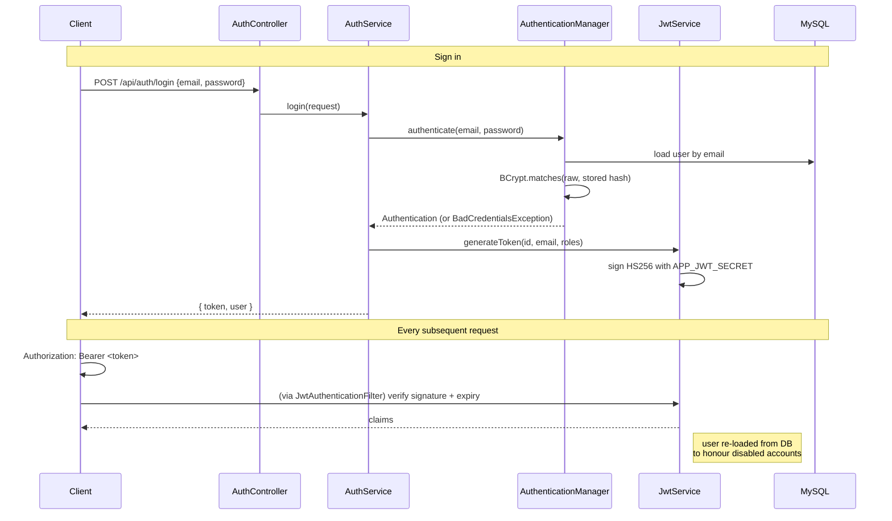
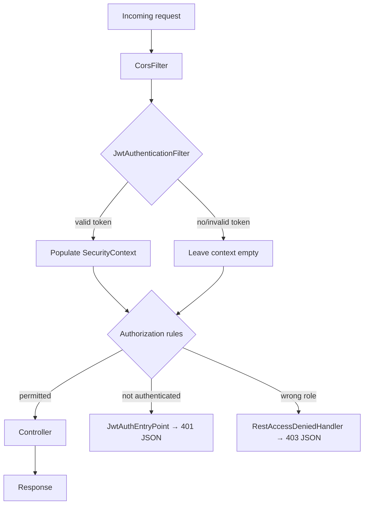

# 05 — Security

How authentication and authorisation work, and — more usefully — **what specific attack each
measure prevents**. A security control you cannot name the threat for is a control you cannot
evaluate.

---

## Passwords

Stored as **BCrypt hashes**, strength 10, configured in `SecurityConfig`:

```java
@Bean
public PasswordEncoder passwordEncoder() {
    return new BCryptPasswordEncoder(10);
}
```

BCrypt salts each hash automatically, so two users with the same password store completely
different values. It is also deliberately slow, which is the point — a fast hash like SHA-256 lets
an attacker with a stolen database test billions of candidate passwords per second.

The plain text never reaches the `User` entity: `AuthService.register` encodes before building it,
and `UserResponse` has no password field at all.

**Prevents:** rainbow-table lookups, cheap offline brute-forcing, and cross-site credential reuse
if the database is ever stolen.

---

## The JWT lifecycle



### What is in the token

```json
{
  "sub": "aisha@example.com",
  "uid": 7,
  "roles": ["ROLE_CUSTOMER"],
  "iss": "ecommerce-api",
  "iat": 1755408000,
  "exp": 1755494400
}
```

Roles travel inside the signed token so authorising a request needs no extra database round trip.
The signature makes those claims tamper-proof: editing `roles` to `["ROLE_ADMIN"]` invalidates the
signature, and `parseSignedClaims` rejects it.

> **A JWT is signed, not encrypted.** Anyone holding the token can read these claims by
> base64-decoding it. That is fine — there is nothing secret in there. Never put anything
> confidential in a JWT payload.

### The signing key

From `APP_JWT_SECRET`, minimum 32 characters (256 bits for HS256). There is **no default anywhere in
the codebase** — `JwtProperties.validate()` refuses to start without it, with instructions.

**Prevents:** the single most common JWT failure, which is a weak or committed default secret
letting anyone forge an admin token.

### Expiry

24 hours by default (`APP_JWT_EXPIRATION_MS`). There is no refresh-token flow; when the token
expires the user signs in again. That is a deliberate simplification for a project of this scope —
production systems typically pair a short-lived access token with a longer refresh token.

---

## The filter chain



### `JwtAuthenticationFilter` never rejects anything

This surprises people. The filter's only job is: *if there is a valid token, say who the user is.*
A missing or bad token simply leaves the context unauthenticated, and the authorisation rules decide
whether that matters.

That separation is what lets anonymous product browsing and protected checkout live in the same
chain without duplicate configuration.

### It re-loads the user from the database

```java
if (jwtService.isTokenValid(token)) {
    String email = jwtService.extractEmail(token);
    UserDetails userDetails = userDetailsService.loadUserByUsername(email);
    if (userDetails.isEnabled()) { ... }
}
```

The token already contains the roles, so this lookup is not strictly necessary for authorisation.
It is there so that **disabling an account takes effect immediately**. Without it, a disabled user
would keep full access until their token expired — up to 24 hours of an account you thought you had
shut off.

**Prevents:** a compromised or dismissed account continuing to operate after being disabled.

---

## Authorisation rules

From `SecurityConfig`, in order:

```java
.requestMatchers("/api/auth/register", "/api/auth/login").permitAll()
.requestMatchers(HttpMethod.GET, "/api/products/**").permitAll()
.requestMatchers(HttpMethod.GET, "/api/categories/**").permitAll()
.requestMatchers("/swagger-ui.html", "/swagger-ui/**", "/v3/api-docs/**").permitAll()
.requestMatchers(HttpMethod.OPTIONS, "/**").permitAll()
.requestMatchers("/api/admin/**").hasRole("ADMIN")
.anyRequest().authenticated()
```

Three principles:

**Read is public, write is not.** Anonymous visitors can browse, search and read reviews, because a
storefront that demands a login to look at a catalogue is useless. The `GET`-only matchers mean
`POST /api/products/{id}/reviews` still requires authentication despite the `/api/products/**`
prefix being public for reads.

**`/api/admin/**` is gated in exactly one place.** One rule covers every current and future admin
endpoint. A new admin controller is protected the moment it is created — it cannot ship unprotected
because someone forgot an annotation.

**`anyRequest().authenticated()` is the default.** A new endpoint that matches no rule requires
authentication. The failure mode of forgetting to configure something is "too locked down", not
"wide open".

### Two failure modes, distinguished

| Situation | Handler | Status | Frontend behaviour |
|---|---|---|---|
| No or invalid token | `JwtAuthEntryPoint` | **401** | Clear session, redirect to login |
| Valid token, wrong role | `RestAccessDeniedHandler` | **403** | Show an error; stay put |

The distinction matters. Bouncing a signed-in customer to a login page because they touched an admin
URL is wrong — they are already signed in. The axios interceptor implements exactly this split.

Both handlers emit the same `ApiError` JSON as every other error, because Spring Security's defaults
would return an HTML page or a `WWW-Authenticate` challenge that pops a browser dialog — neither of
which a React client can handle.

---

## Preventing cross-user data access

The most important guarantee in the application: **a customer can only ever see their own data.**

It is not enforced by remembering to write a check. It is enforced by the shape of the code.

### Identity comes from the token, never the request

```java
// CartController
public ResponseEntity<CartResponse> getCart(@AuthenticationPrincipal UserPrincipal principal) {
    return ResponseEntity.ok(cartService.getCart(principal.getId()));
}
```

No endpoint anywhere accepts a user id from a path, query or body. There is no parameter to tamper
with.

### Ownership-scoped queries

Where a resource *does* have a client-supplied id, the repository method includes the owner:

```java
Optional<Order>   findByIdAndUserId(Long id, Long userId);      // OrderRepository
Optional<Address> findByIdAndUserId(Long id, Long userId);      // AddressRepository
Optional<CartItem> findByIdAndCartId(Long id, Long cartId);     // CartItemRepository
```

Requesting another customer's order id returns `Optional.empty()` → `ResourceNotFoundException` →
404. Not a 403, which would confirm the order exists.

### The cart has no id-based lookup at all

`CartRepository` exposes only `findByUserId`. There is no way to fetch a cart by its primary key,
so a future endpoint cannot accidentally introduce the vulnerability.

**Prevents:** insecure direct object reference (IDOR) — incrementing an id in a URL to read someone
else's orders, addresses or cart.

---

## Preventing privilege escalation

`RegisterRequest` has four fields: `fullName`, `email`, `password`, `phoneNumber`. There is no
`roles` field, and `AuthService.register` hard-codes the assignment:

```java
Role customerRole = roleRepository.findByName(RoleName.ROLE_CUSTOMER)...;
User user = User.builder()... .roles(Set.of(customerRole)).build();
```

Sending `{"email": "...", "roles": ["ROLE_ADMIN"]}` does nothing — Jackson has nowhere to bind it.

**Prevents:** mass-assignment privilege escalation, where an extra JSON field silently maps onto an
entity property.

---

## Preventing price tampering

The client never sends a price. Not when adding to a cart, not at checkout.

- `AddToCartRequest` carries `productId` and `quantity` only.
- `PlaceOrderRequest` carries an address choice only — **no line items at all**.
- `OrderService.placeOrder` rebuilds the order from the server-side cart, reads each price from the
  product row inside the transaction, and computes the total in `BigDecimal`.

**Prevents:** the classic e-commerce attack of intercepting the checkout request and changing the
total, or adding an item at a price you chose.

---

## Preventing overselling

Stock is validated twice, and only the second check matters:

1. `CartService` checks when an item is added — a courtesy, so the customer learns early.
2. `OrderService.placeOrder` re-reads the product **inside the checkout transaction** and checks
   again before decrementing.

Between adding to a cart and paying, another customer may have taken the last unit. Only a check
inside the same transaction that decrements stock is authoritative. If it fails,
`InsufficientStockException` rolls the entire order back — no partial order, no negative stock.

---

## Input validation

Two layers.

**Bean Validation on DTOs**, checked before any controller code runs:

```java
@Pattern(regexp = "^\\+[1-9]\\d{7,14}$",
         message = "Phone number must be in international format, e.g. +919876543210")
String phoneNumber
```

Failures become a 400 with a per-field map the form renders inline.

**Business validation in services** for rules that span entities: stock availability, status
transitions, review eligibility, category deletion when products still reference it.

### SQL injection

Not possible through the normal code paths:

- Spring Data derived queries and `@Query` use bound parameters.
- `ProductSpecification` builds JPA Criteria predicates — values are bound, never concatenated.
- The `sort` parameter, which *would* be dangerous if passed through, is an **allow-list**:

  ```java
  return switch (sort.trim().toLowerCase()) {
      case "price_asc"  -> Sort.by(ASC, "price");
      case "rating"     -> Sort.by(DESC, "averageRating")...;
      default           -> Sort.by(DESC, "dateAdded");
  };
  ```

  An unrecognised value falls back to newest rather than reaching the database as a property name.

---

## CORS

```java
configuration.setAllowedOrigins(corsProperties.getAllowedOrigins());  // explicit list
configuration.setAllowedMethods(List.of("GET","POST","PUT","PATCH","DELETE","OPTIONS"));
configuration.setAllowedHeaders(List.of("Authorization","Content-Type","Accept","Origin"));
configuration.setAllowCredentials(true);
```

An explicit origin list, from `APP_CORS_ALLOWED_ORIGINS`, not a wildcard. `allowCredentials(true)`
forbids `*` by specification anyway, but the real reason is that a deployment should only accept the
frontends it actually owns.

In development this rarely fires: Vite proxies `/api` to the backend, so the browser sees one origin.

---

## Why CSRF is disabled

```java
.csrf(csrf -> csrf.disable())
```

This is safe **because** authentication is a bearer token, not a cookie.

CSRF works by tricking a browser into sending a request that automatically carries the victim's
session cookie. Our token lives in `localStorage` and is attached by explicit JavaScript, so a
cross-site form post carries no credentials at all — there is nothing to ride on.

If this application were changed to store the JWT in a cookie, CSRF protection would become
mandatory again.

---

## Secrets management

| Secret | Source | Default |
|---|---|---|
| `APP_JWT_SECRET` | env var | **none — startup fails** |
| `DB_PASSWORD` | env var | **none — startup fails** |
| `ADMIN_PASSWORD` | env var | **none — no admin created** |
| `TWILIO_ACCOUNT_SID` / `TWILIO_AUTH_TOKEN` | env var | empty → log-only mode |

`.env` is git-ignored; `.env.example` is committed with empty values as a template. `run.ps1` loads
`.env` into the process environment.

Nothing sensitive is logged: `TwilioWhatsAppService` masks phone numbers to the last four digits,
and credentials are never printed.

---

## Known limitations

Honest scope boundaries — worth knowing before anyone deploys this:

- **No rate limiting.** The login endpoint can be brute-forced. A real deployment needs throttling
  (Bucket4j, or a gateway/WAF rule).
- **No refresh tokens.** A stolen token is valid until it expires, and there is no revocation list.
- **JWT in `localStorage`** is readable by any JavaScript running on the page, so it is vulnerable
  to XSS. React escapes rendered content by default, which is the main mitigation, but an
  `httpOnly` cookie plus CSRF protection is stronger.
- **No password reset flow.** Only a signed-in user can change their password.
- **No account lockout** after repeated failures.
- **HTTP in development.** Any real deployment must be HTTPS-only — a bearer token over plain HTTP
  is readable by anyone on the network path.

---

**Next:** [06 — API Reference](06-api-reference.md) for the endpoint catalogue.
