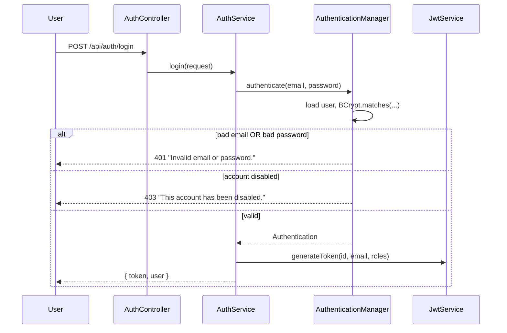
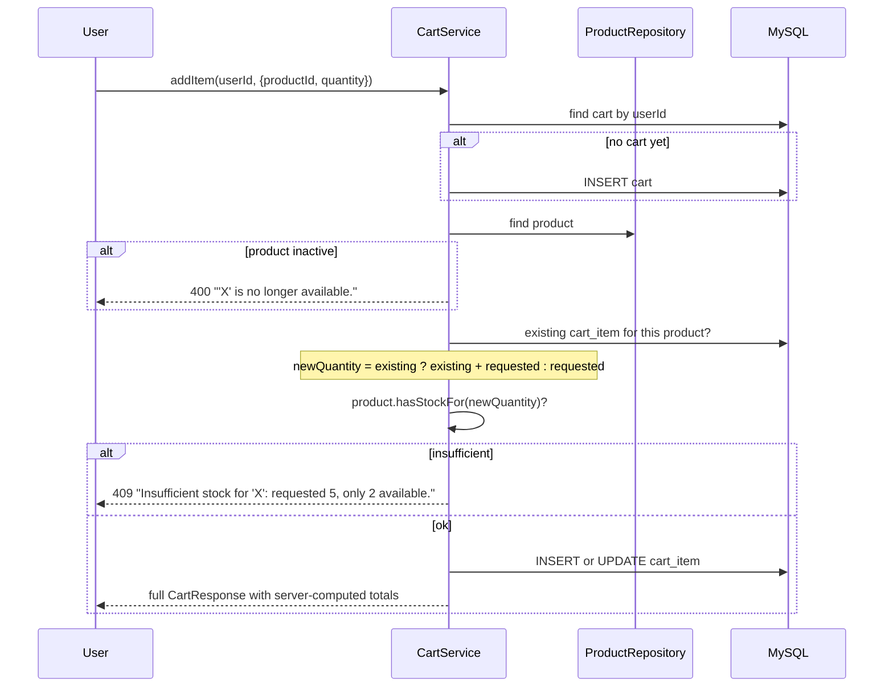
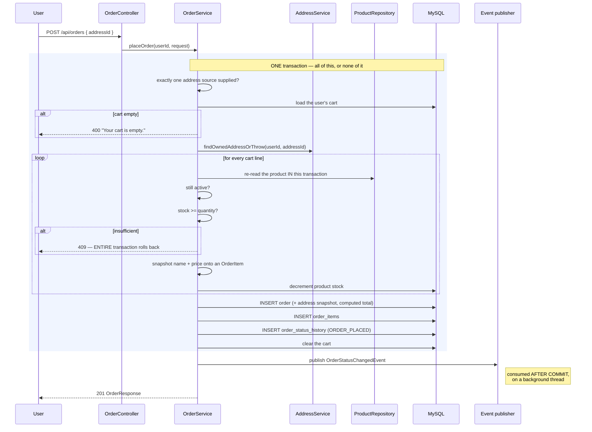
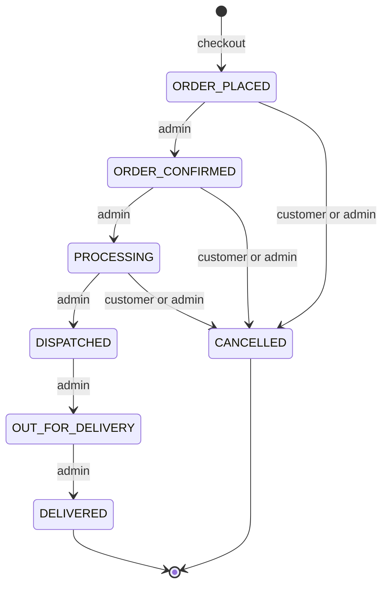
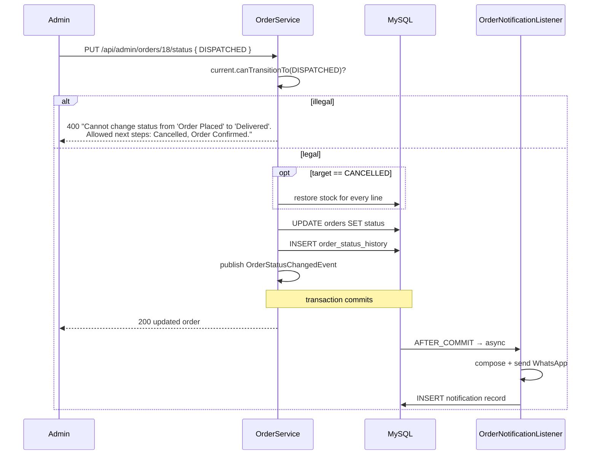
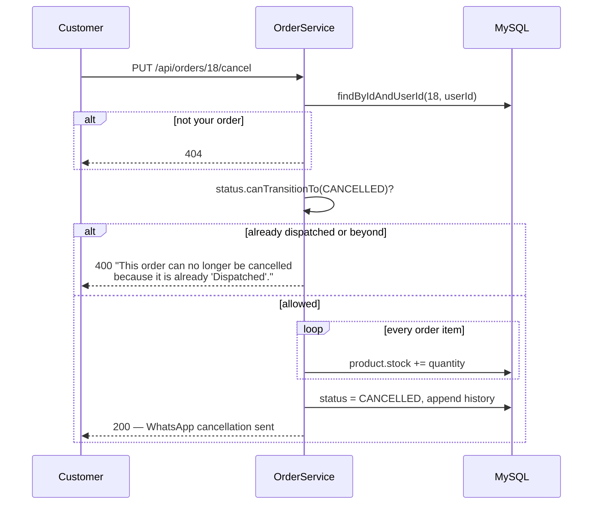
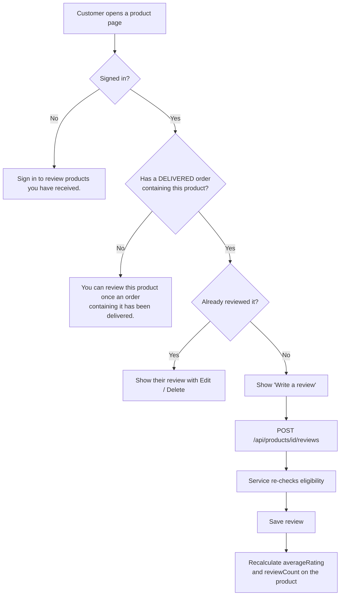
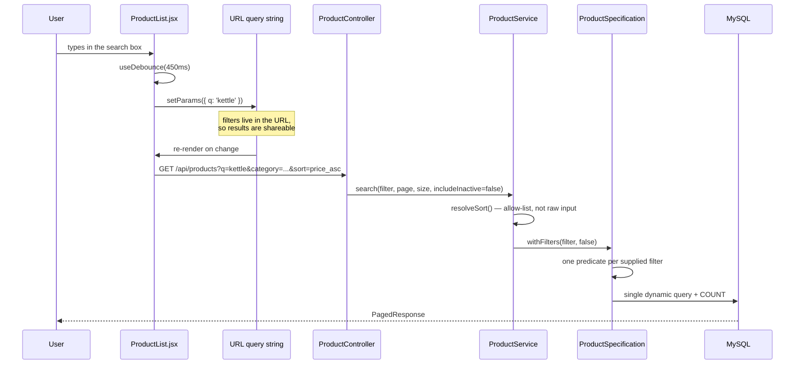
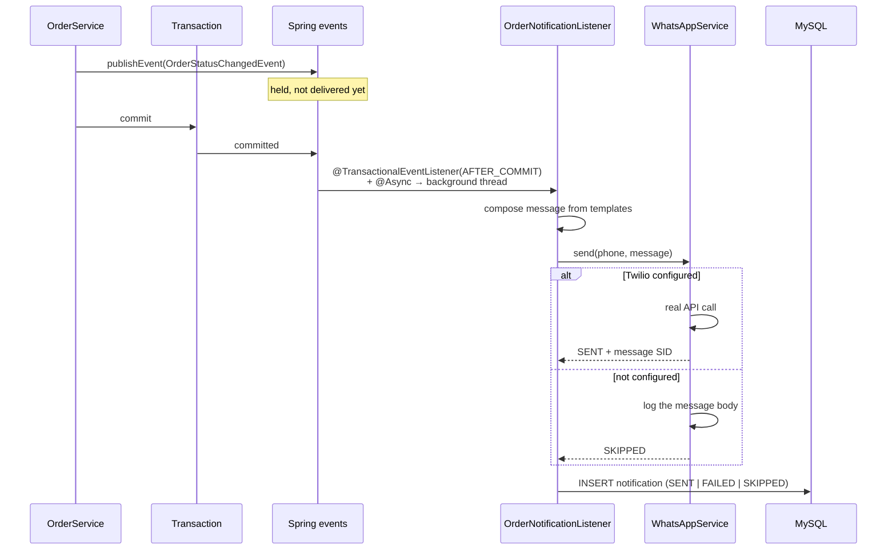

# 08 — Business Flows

The important journeys, as sequence diagrams, with the rules that govern each.

---

## 1. Registration

```mermaid
sequenceDiagram
    participant U as User
    participant R as Register.jsx
    participant AC as AuthContext
    participant API as AuthController
    participant AS as AuthService
    participant DB as MySQL

    U->>R: fills the form
    R->>R: check password == confirmPassword<br/>(client-only; the API has no such field)
    R->>AC: register(payload)
    AC->>API: POST /api/auth/register
    API->>API: @Valid — email format, password ≥ 8,<br/>phone matches E.164
    API->>AS: register(request)
    AS->>DB: existsByEmail(email)?
    alt already registered
        AS-->>U: 409 "An account with this email already exists."
    else available
        AS->>AS: BCrypt.encode(password)
        AS->>DB: look up ROLE_CUSTOMER
        AS->>DB: INSERT user + user_roles
        AS->>AS: generate JWT
        AS-->>AC: { token, user }
        AC->>AC: store token + user, set state
        AC-->>U: signed in, redirected
    end
```

**Rules**

- Email is unique and lower-cased before storage.
- Password is BCrypt-hashed; the plain text never reaches the entity.
- Phone must be E.164 — it is the WhatsApp destination.
- **The role is assigned server-side and is always `ROLE_CUSTOMER`.** `RegisterRequest` has no
  `roles` field, so a request body cannot ask for admin.
- Success signs the user straight in, so registration is one step rather than two.

---

## 2. Sign in



**Rules**

- Delegating to `AuthenticationManager` means an unknown email and a wrong password produce the
  **same** exception and message — so the endpoint cannot be used to discover registered emails.
- Admins use this same endpoint; the frontend routes them to `/admin` afterwards based on their
  roles.
- Where the user is sent next: `?redirect=` if present, else `/admin` for admins, else `/`.

---

## 3. Add to cart



**Rules**

- The cart is resolved from the **authenticated user id only**. No endpoint accepts a cart id.
- Adding an existing product **increments** rather than duplicating — enforced by the unique
  constraint on `(cart_id, product_id)` as well as the service check.
- Quantity updates are **absolute**, not deltas, so a retried request is idempotent.
- No price is ever sent by the client; totals are computed server-side in `BigDecimal`.
- This stock check is a courtesy. The authoritative one happens at checkout.

---

## 4. Checkout

The most important flow in the system.



### Why each guarantee holds

| Guarantee | Mechanism |
|---|---|
| **You cannot buy at a price you chose** | `PlaceOrderRequest` has no line items or prices. The order is rebuilt from the server-side cart, reading prices from the product rows. |
| **You cannot oversell** | Products are re-read *inside* the checkout transaction. A failure rolls back every decrement made so far. |
| **No half-written orders** | One `@Transactional` method covers validation, stock, order, items, history and cart clearing. |
| **Price changes cannot rewrite history** | `OrderItem` snapshots `productName` and `unitPrice`. |
| **Address edits cannot rewrite history** | `Order` snapshots all eight delivery fields. |
| **A Twilio outage cannot break checkout** | Notification is an event consumed after commit, asynchronously. |

> **Why stock is checked twice.** `CartService` checks when an item is added so the customer finds
> out early. But between adding to a cart and paying, another customer may take the last unit. Only
> the check inside the transaction that decrements stock is authoritative.

---

## 5. Order status lifecycle



Every transition:



**Rules**

- Legality is decided by `OrderStatus.canTransitionTo` — one map, consumed everywhere.
- `GET /api/admin/orders/statuses` exposes `allowedNext`, so the admin dropdown can only *offer*
  legal transitions. An illegal jump is unselectable, not merely rejected.
- Cancelling restores stock, whoever initiates it.
- Every change appends history; nothing is overwritten.
- `DELIVERED` and `CANCELLED` are terminal.

---

## 6. Cancellation



**Why the cut-off is dispatch:** once a parcel has physically left, returning its items to the stock
count would make the inventory wrong. Those cases need a returns process, which this system does not
model.

---

## 7. Review eligibility



**Rules**

- Eligibility is `OrderRepository.hasUserPurchasedProduct` — a `DELIVERED` order containing that
  product. Placed-but-undelivered does not count.
- One review per customer per product, enforced by a unique constraint on
  `(product_id, user_id)`. Posting again updates the existing one.
- Rating is 1–5; text is optional.
- **The service re-checks eligibility on submit.** `canReview` in the summary response is for
  rendering; the authoritative check happens server-side on write.
- After any change, `products.average_rating` and `review_count` are recomputed from scratch, so
  they can never drift from the underlying rows.

---

## 8. Product browsing and filtering



**Rules**

- One endpoint and one specification serve browse, category pages, search, filtering and sorting.
- Search covers name, description and brand.
- `sort` is an allow-list; unknown values fall back to `newest` rather than reaching the database.
- Only `active` products are returned to the storefront. The admin listing passes
  `includeInactive = true`.
- Search is debounced by 450 ms, so typing fires one request when you pause.
- Changing a filter resets to page 1 — otherwise narrowing a search while on page 5 lands you
  on an empty page.

---

## 9. Notification pipeline



Covered in depth in [09 — WhatsApp Notifications](09-whatsapp-notifications.md). The essential
point: `AFTER_COMMIT` + `@Async` means a notification can never delay, block, or roll back an order.

---

**Next:** [09 — WhatsApp Notifications](09-whatsapp-notifications.md).
