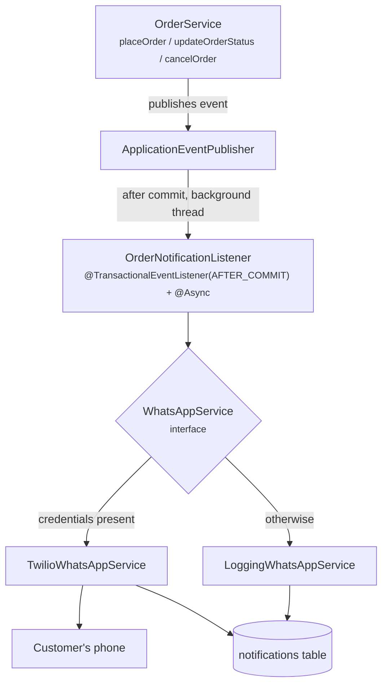

# 09 — WhatsApp Notifications

How order notifications work, how to switch on real delivery through Twilio, and how to debug them
when they do not arrive.

---

## The short version

When an order is placed or its status changes, the customer gets a WhatsApp message.

**It works with no Twilio account at all.** Without credentials, the message is composed, written to
the log, and recorded in the `notifications` table with status `SKIPPED`. Every flow stays testable
and demonstrable; only the network call is missing.

---

## The design, and why



### Why `OrderService` publishes an event instead of calling the sender

Three problems with a direct call, each real:

**1. Notifying about an order that does not exist.** A plain method call — or a plain
`@EventListener` — runs *inside* the checkout transaction. If anything later in that transaction
fails and rolls back, the customer has a WhatsApp message for an order that was never saved.

`@TransactionalEventListener(phase = AFTER_COMMIT)` fixes this: the listener only runs once the
transaction has durably committed.

**2. Making the customer wait for Twilio.** A network call to an external API can take seconds, or
hang until it times out. Inline, that delay sits between the customer clicking "Place order" and
seeing their confirmation.

`@Async` fixes this: delivery happens on a background thread from the pool configured in
`application.yml` (`spring.task.execution`), and the HTTP response returns immediately.

**3. An outage breaking checkout.** If the sender threw, the exception would propagate into
`OrderService` and roll the order back. A messaging provider having a bad day would stop the shop
taking orders.

Fixed three ways: the listener runs outside the order's transaction; `TwilioWhatsAppService` catches
everything and returns a `FAILED` result rather than throwing; and the listener wraps its own work
in a try/catch as a final backstop.

> **In one sentence:** the ordering guarantees that a notification can never delay, block, or
> roll back an order — the order is the important thing, the message is a side effect.

### Why the sender is behind an interface

`WhatsAppService` has one method. Nothing outside the `notification` package knows Twilio exists.

```java
public interface WhatsAppService {
    SendResult send(String toPhoneNumber, String message);
    String providerName();
}
```

Which implementation runs is decided **once, at startup**, in `NotificationConfig`:

```java
@Bean
public WhatsAppService whatsAppService(WhatsAppProperties properties) {
    if (properties.isFullyConfigured()) {
        return new TwilioWhatsAppService(properties);
    }
    String reason = !properties.isEnabled()
            ? "app.whatsapp.enabled is false"
            : "Twilio credentials are incomplete (...)";
    return new LoggingWhatsAppService(reason);
}
```

Deciding at startup rather than per message keeps the branch out of the hot path, and makes the
active mode obvious in the startup log — the first thing to check when messages are not arriving.

Swapping to a different provider, or adding SMS or email, means adding an implementation. No change
to `OrderService`.

---

## The two implementations

### `TwilioWhatsAppService`

Active when `app.whatsapp.enabled=true` **and** all three credentials are present.

```java
Message sent = Message.creator(
        new PhoneNumber("whatsapp:" + toPhoneNumber),
        new PhoneNumber(properties.normalisedFromNumber()),
        message
).create();
return SendResult.sent(sent.getSid());
```

Notes:

- Twilio requires the `whatsapp:` scheme prefix on **both** the sender and the recipient. The
  service adds it if missing, so stored phone numbers stay plain E.164.
- `ApiException` (Twilio rejecting the message) and any other exception are both caught and turned
  into a `FAILED` result carrying the reason.
- Phone numbers are masked to the last four digits in logs. Credentials are never logged.

### `LoggingWhatsAppService`

The fallback. Logs the full message and returns `SKIPPED`:

```
[WhatsApp - NOT SENT]
  To      : +919876543210
  Message : Hi Aisha, your order #ORD-20260817-4821 has been dispatched and is on its way.
            You will receive another notification when it is out for delivery.
```

At startup it prints a banner explaining why it is active and what to set to enable real sending.

**This is what makes the project runnable by anyone.** A marker or a classmate can clone the repo,
run it, place an order, advance it through every status, and see exactly what each customer would
have received — all without a Twilio account.

---

## Message templates

`WhatsAppMessageTemplates.forStatus(customerName, orderNumber, status)` returns the body for each
status. Kept in one class so wording can be changed without touching order logic, and so the
compiler guarantees every status has a message (the `switch` is exhaustive over the enum).

| Status | Message |
|---|---|
| `ORDER_PLACED` | *Hi Aisha, thank you for shopping with us! Your order #ORD-… has been placed successfully. We will notify you as soon as it is confirmed.* |
| `ORDER_CONFIRMED` | *Hi Aisha, good news! Your order #ORD-… has been confirmed and is being prepared for shipment.* |
| `PROCESSING` | *Hi Aisha, your order #ORD-… is now being processed and packed. We will let you know the moment it is dispatched.* |
| `DISPATCHED` | *Hi Aisha, your order #ORD-… has been dispatched and is on its way. You will receive another notification when it is out for delivery.* |
| `OUT_FOR_DELIVERY` | *Hi Aisha, your order #ORD-… is out for delivery and should reach you today. Please keep your phone nearby so our delivery partner can contact you.* |
| `DELIVERED` | *Hi Aisha, your order #ORD-… has been delivered. We hope you love it! Do leave a review to help other shoppers.* |
| `CANCELLED` | *Hi Aisha, your order #ORD-… has been cancelled. Any amount paid will be refunded to the original payment method. Contact support if you need help.* |

Only the first name is used, so the greeting reads naturally regardless of how long the stored name
is.

---

## The audit trail

Every attempt writes a row to `notifications`, whatever the outcome:

| Status | Meaning |
|---|---|
| `SENT` | Twilio accepted it. `provider_message_id` holds the message SID. |
| `FAILED` | Twilio rejected it or the call threw. `error_message` says why. |
| `SKIPPED` | Sending was disabled or unconfigured. The message was logged only. |

Recording skipped and failed attempts — not just successes — is what makes the question *"did the
customer actually hear about this?"* answerable.

Visible in the admin dashboard at **Notifications**, and per-order on the admin order detail page.

---

## Setting up Twilio

Twilio's WhatsApp **sandbox** is the fastest route and needs no Meta Business verification — good
enough for a college project or a demo.

### 1. Create an account

Sign up at https://www.twilio.com/try-twilio. The free trial includes credit.

### 2. Join the WhatsApp sandbox

In the Twilio Console: **Messaging → Try it out → Send a WhatsApp message**.

You will see a sandbox number (usually `+1 415 523 8886`) and a join code like `join olive-tiger`.
**Send that exact phrase from your WhatsApp to that number.** You should get a confirmation reply.

> **Sandbox limitation:** every recipient must join individually before they can be messaged. For a
> demo, join with the phone number you register your test customer account with. A production
> deployment needs an approved WhatsApp Business sender and pre-approved message templates.

### 3. Copy your credentials

From the Console dashboard: **Account SID** and **Auth Token**.

### 4. Configure the backend

In `backend/.env`:

```bash
WHATSAPP_ENABLED=true
TWILIO_ACCOUNT_SID=ACxxxxxxxxxxxxxxxxxxxxxxxxxxxxxxxx
TWILIO_AUTH_TOKEN=your_auth_token_here
TWILIO_WHATSAPP_FROM=whatsapp:+14155238886
```

### 5. Restart and verify

Restart the backend. You should now see:

```
Twilio WhatsApp sender initialised (from=whatsapp:+14155238886)
WhatsApp notifications ENABLED via Twilio.
```

instead of the "INACTIVE" banner.

### 6. Test it

1. Register a customer whose phone number is the one you joined the sandbox with — in E.164 form,
   e.g. `+919876543210`.
2. Place an order.
3. A WhatsApp message should arrive within a few seconds.
4. Check **Admin → Notifications**: the row should show `SENT` with a `provider_message_id`.

---

## Configuration reference

| Variable | Default | Purpose |
|---|---|---|
| `WHATSAPP_ENABLED` | `false` | Master switch. `false` forces log-only mode even with credentials. |
| `TWILIO_ACCOUNT_SID` | empty | Account SID (starts `AC`) |
| `TWILIO_AUTH_TOKEN` | empty | Auth token |
| `TWILIO_WHATSAPP_FROM` | empty | Sender, e.g. `whatsapp:+14155238886` |

All four come from the environment. Nothing is hard-coded; `.env` is git-ignored.

`WhatsAppProperties.isFullyConfigured()` requires the switch **and** all three values — a partially
configured setup degrades to log-only rather than failing at send time.

---

## Debugging

### Nothing arrives on the phone

Work down this list:

**1. Which sender is active?** Check the startup log.

```
WhatsApp notifications ENABLED via Twilio.        ← good
WhatsApp sending is INACTIVE - ...                ← log-only mode
```

If inactive, the banner names the reason. Usually `WHATSAPP_ENABLED` is still `false`, or `.env`
was edited without restarting.

**2. What does the audit trail say?** Admin → Notifications, or:

```sql
SELECT id, recipient, trigger_status, status, provider_message_id, error_message, created_at
FROM notifications ORDER BY created_at DESC LIMIT 10;
```

| What you see | Meaning |
|---|---|
| No rows at all | The event never fired — see step 4 |
| `SKIPPED` | Log-only mode. Back to step 1. |
| `FAILED` | Twilio rejected it. Read `error_message` — see the table below. |
| `SENT` | Twilio accepted it. The problem is downstream — check the Twilio Console message log. |

**3. Common Twilio errors**

| Code | Meaning | Fix |
|---|---|---|
| `63015` / `63016` | Recipient has not joined the sandbox, or the 24-hour session has expired | Re-send the `join <phrase>` code from that phone |
| `21211` | Invalid `To` number | Must be E.164: `+919876543210`, no spaces or dashes |
| `20003` | Authentication failed | Wrong SID or auth token |
| `21606` | The `From` number is not a valid WhatsApp sender | Check `TWILIO_WHATSAPP_FROM`, including the `whatsapp:` prefix |

**4. No notification rows at all**

The event is not reaching the listener. Check:

- `@EnableAsync` is present on `EcommerceApplication` (it is, by default)
- The order status actually changed — re-applying the same status is rejected with a 400
- Look for a `Failed to process notification for order` error in the backend log

### Messages arrive but are slow

Expected. Delivery is asynchronous by design, so it happens shortly *after* the API response. The
smoke test allows for this with a brief wait before asserting notification rows exist.

### Testing without a phone

You do not need one. Leave `WHATSAPP_ENABLED=false` and watch the backend log — every message body
is printed in full, and every attempt is recorded in the database and visible in the admin UI.

---

## Extending to another channel

The seam is `WhatsAppService`. To add, say, email:

1. Write `EmailNotificationService implements WhatsAppService` (or extract a broader
   `NotificationChannel` interface first, if you want both at once).
2. Register it in `NotificationConfig`.
3. Add templates alongside `WhatsAppMessageTemplates`.
4. The `notifications` table already has a `channel` column ready for it.

`OrderService` does not change — it publishes events and knows nothing about delivery.

Recipes in [12 — Extending](12-extending.md).

---

**Next:** [10 — Admin Dashboard](10-admin-dashboard.md).
